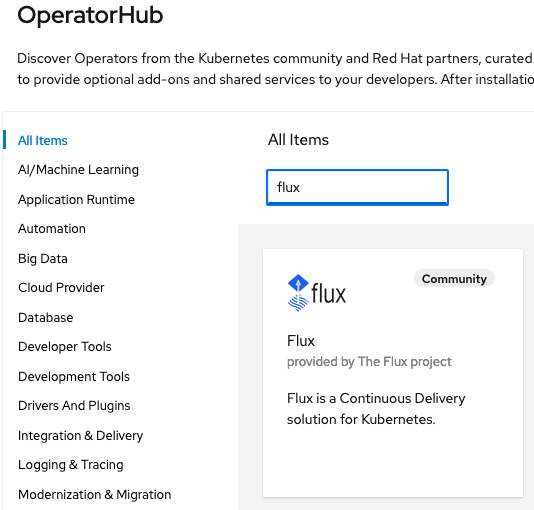

# DBA Serverless and GitOps Samples
## Install and setup

This section provides runtimes, middlewares installation and basic setup for a Quarkus and Kogito based Serverless Business Automation development, test, and deployment platform.

## Table of Contents

- [Quarkus](#Quarkus)
- [RH Business Automation](#RH-Business-Automation)
  - [RH PAM local install](#RH-PAM-local-install)
  - [RH DM local install](#RH-DM-local-install)
  - [Openshift Operator install](#Openshift-Operator-install)
- [RHPAM Kogito](#RHPAM-Kogito)
- [RH OpenShift Serverless -- Knative](#RH-OpenShift-Serverless-Knative)
- [RH OpenShift Pipelines -- Tekton](#RH-OpenShift-Pipelines-Tekton)
- [RH OpenShift GitOps -- ArgoCD](#RH-OpenShift-GitOps-ArgoCD)
- [Flux CD](#Flux-CD)
- [More, Guides, and References](#More-Guides-and-References)


## Quarkus

## RH Business Automation
### RH PAM local install
To install RH PAM on your own machine or on an OpenShift Container Platform or OpenShift, follow the *Red Hat Process Automation Manager 7 Install Demo* which is a Project to automate the installation of this product without preconfiguration beyond a single admin user.
 Clone: [https://github.com/jbossdemocentral/rhpam7-install-demo](https://github.com/jbossdemocentral/rhpam7-install-demo)
Very straightforward, steps summary

1. Clone git@github.com:jbossdemocentral/rhpam7-install-demo.git
2. Add products(*) to the *installs* directory, see installs/README for details and links.
3. Run 'init.sh' or 'init.bat' file. 'init.bat' must be run with Administrative privileges.

**Done!** To run it:
  - Start server: 
    - ./target/jboss-eap-7.4/bin/standalone.sh
  - Login in: 
    - http://localhost:8080/business-central
    - user: pamAdmin / password: redhatdm1!

(*) **Notes:** the products to download and copy/move to the *installs* directory are (edit version when needed):
* Red Hat Enterprise Application Platform archive (jboss-eap-7.3.0.zip) at https://developers.redhat.com/products/eap/download
* Red Hat Process Automation Manager deployable (rhpam-7.11.0-business-central-eap7-deployable.zip) at https://developers.redhat.com/products/rhpam/download
* Red Hat Process Automation Manager Process Server (KIE Server) deployable (rhpam-7.11.0-kie-server-ee8.zip) at https://developers.redhat.com/products/rhpam/download
* Red Hat Process Automation Manager add ons (rhpam-7.11.0-add-ons.zip) at https://developers.redhat.com/products/rhpam/download

You can update all version to the latest: jboss-eap to 7.4 and all rhpam to 7.12.0. I you do so, edit and update *init.sh* as accordingly, before running it.
Watch a short (5 mn) [PAM demo install video reference](https://www.youtube.com/watch?v=x6U8CiPU9cU)

### RH DM local install
Follow the same procedure as for RH PAM above. For RH DM, the repo to clone is:
Clone [https://github.com/jbossdemocentral/rhdm7-install-demo](https://github.com/jbossdemocentral/rhdm7-install-demo)

### Openshift Operator install
 [https://docs.openshift.com/container-platform/4.10/cicd/gitops/installing-openshift-gitops.html](https://docs.openshift.com/container-platform/4.10/cicd/gitops/installing-openshift-gitops.html)

## RHPAM Kogito
Guide to install Kogito on OpenShift: [https://docs.kogito.kie.org/latest/html_single/#chap-kogito-deploying-on-openshift](https://docs.kogito.kie.org/latest/html_single/#chap-kogito-deploying-on-openshift)

## RH OpenShift Serverless (Knative)

## RH OpenShift Pipelines (Tekton)

## RH OpenShift GitOps (ArgoCD)
- Detailed installation instruction on [Red Hat docs](https://docs.openshift.com/container-platform/4.10/cicd/gitops/installing-openshift-gitops.html)
- Install from Console summary:
  - Go to OCP OperatorHub
  - Search for **Red Hat OpenShift GitOps**
  - Click Install
  - Provided APIs: **AppProject**, **Argo CD**, **Application**, **ApplicationSet**
  - RH OpenShift GitOps Operator automatically creates a ready-to-use **Argo CD** instance that is available in the openshift-gitops namespace.
  - Navigate to the red hat applications menu icon  → OpenShift GitOps → Cluster Argo CD. The login page of the Argo CD UI is displayed in a new window. Two options to login:
    - Login to Argo Console using OpenShift SSO: select the *LOG IN VIA OPENSHIF* option in the UI
    - Login using the user *admin* that has been created by the Operator. To retrieve the password, go to Secret on project **openshift-gitops**, select the *openshift-gitops-cluster* instance to display the password, copy the password

## Flux (CD)
- **Mac CLI install:**
```shell
brew install fluxcd/tap/flux
```
- **Bash install:**
```shell
curl -s https://fluxcd.io/install.sh | sudo bash
```
A Boostrap command will install the Flux CRs on Kubernetes/OCP, see [Getting started ReadMe](../gitops/infra-fluxcd/README.md) for details.

- **OCP Operator Flux CRs install**
  From OCP OperatorHub, look for *Flux* and install...

  

## More Guides and References
