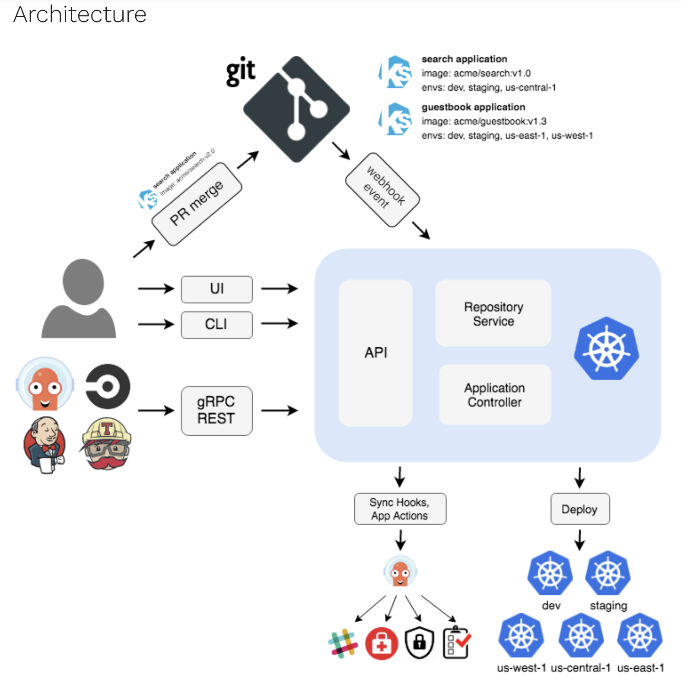

# DBA Serverless and GitOps Samples
### GitOps Samples - ArgoCD Samples

## ArgoCD Architecture

## Sanples
- The samples under folder deployment are working samples to deploy/sync the Content Webhook knative services/apps
- The samples folder contains a working manifest to create:
  - an ArgoCD Application: *argocd-app.yaml*
  - an ArgoCD ApplicationSet PR Generator: *argocd-pr-generator.yaml*

Notes: 
ArgoCD ApplicationSet controller allow mass-production of Argo CD Applications and deploys them onto multiple clusters. 
ApplicationSets accomplishes this task by using generators. 
Generators vary from use case to use case and depend on things like the Git repository structure, configuration files, key/value lists, and cluster names.
A PR Generator template: *argocd-pr-generator.yaml*

## ArgoCD References
- RedHat Openshift 4.10 GitOps Home:
  - https://docs.openshift.com/container-platform/4.10/cicd/gitops/understanding-openshift-gitops.html
- ArgoCD Project Home:
  - https://argoproj.github.io/cd
- ArgoCD Documentation, Assets and Tutorials
  - https://argo-cd.readthedocs.io/en/stable/
  - https://github.com/argoproj/argo-cd
- PR Generator (ApplicationSet) tutorial
 - https://developers.redhat.com/articles/2022/04/05/automate-cicd-pull-requests-argo-cd-applicationsets

