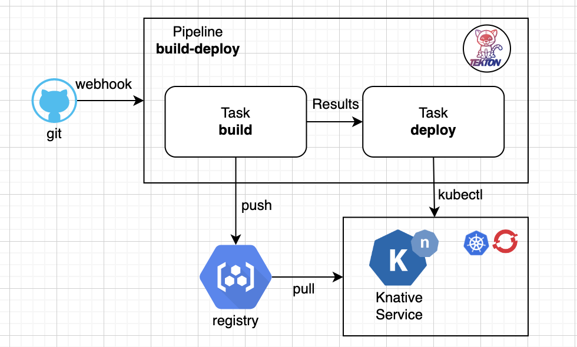
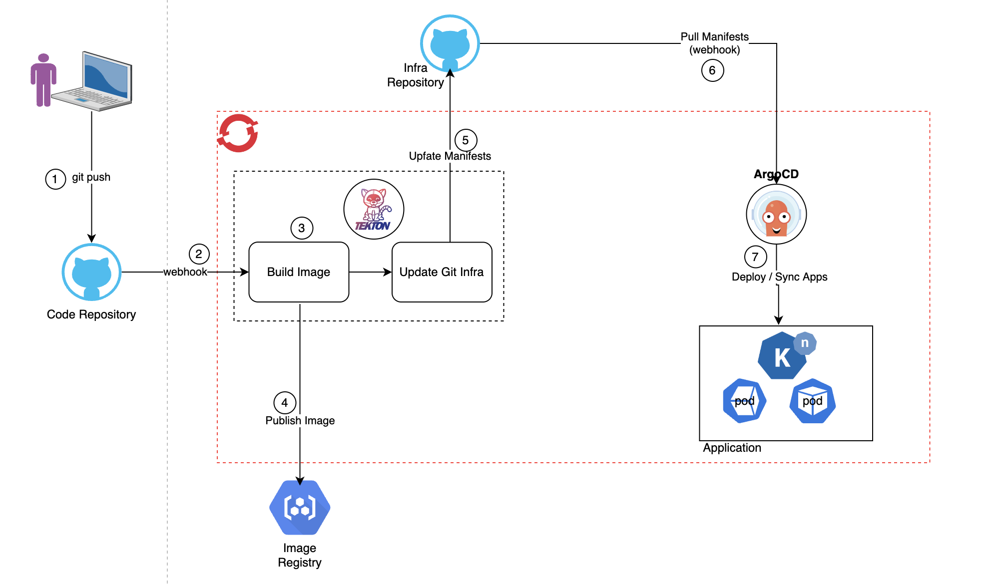
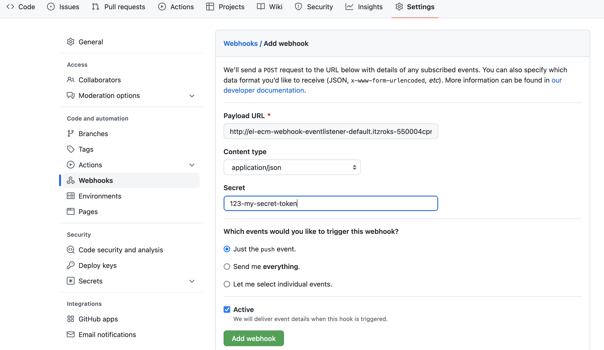

# DBA Serverless and GitOps Samples
## GitOps Samples - Tekton Pipeline Samples


## Table of Contents
- [Introduction](#introduction)
- [Use cases](#use-cases)
  - [Tekton for CI/CD](#tekton-for-cicd)
  - [Tekton for CI with Argo for CD](#tekton-for-ci-with-argo-for-cd)
- [Samples inventory](#samples-inventory)
  - [Resources](#resources)
  - [Tasks](#tasks)
  - [Pipelines](#pipelines)
  - [Triggers](#triggers)
- [Running the pipelines](#running-the-pipelines)
- [References and Guides](#references-and-guides)


## Introduction
- [Tekton](https://tekton.dev/) is an open-source framework for Continuous Integration and Delivery (CI/CD) systems.
- [Red Hat OpenShift Pipelines](https://docs.openshift.com/container-platform/4.10/cicd/pipelines/understanding-openshift-pipelines.html) is built on top of Tekton
- If you are new to Tekton and RH OpenShift Pipelines, then jump to the last section: [References and Guides](#references-and-guides) to get familiar with the basics concepts

## Use cases

### Tekton for CI/CD
  

High level Flow:  
1 git (src) push   
2 git tkn webhook triggers the tkn pipeline  
3 tkn pipeline *Build Src Task* clones and compiles src (e.g. mvn or gradle for a quarkus src) and generates artifact   
4 tkn pipeline *Build Image Task* builds and pushes image to Image Registry (OCP Internal Registry, quay.io, etc...)  
5 tkn *Deploy Task fetches* images from Registry and deploys to OCP (create a kn service in this example)  

### Tekton for CI with Argo for CD


High level Flow:  
1 git (src) push   
2 git tkn webhook triggers the tkn pipeline  
3 tkn *Build Src Task* clones and compiles src (e.g. mvn or gradle for a quarkus src) and generates artifact  
4 tkn *Build Image Task* builds and publishes image to Image Registry (OCP Internal Registry, quay.io, etc...)  
5 tkn *Update Manifest Task* update the deployment manifest in the Infra (ArgoCD) git repo  
6 ArgoCD pulls (webhook) desired state from git Infra  
7 ArgoCD sync current state (actual deploy on OCP) to desired state (defined by latest manifests in Infra/ArgoCD repo)  

## Samples inventory
Each subsection has a specific README for details
### Resources
- *workspace-pvc.yaml*: a PVC to back the Tekton [workspaces](https://tekton.dev/docs/pipelines/workspaces/) used across Tekton taks
- *Template-docker-creds-secret.yaml*: use to create docker-creds-secret.yaml which is already listed on .gitignore and will be excluded from git check in
- *Template-git-secret.yaml*: use to create git-src-secret.yaml and git-argocd-creds-secret.yaml which are already listed on .gitignore and will be excluded from git check in
- *Template-redhat-pull-secret.yaml*: use to create (when needed, to get the RH OCP CLI for example) redhat-pull-secret.yaml which is already listed on .gitignore and will be excluded from git check in
### Tasks
- *common/apply-ocp-manifest-task.yaml*: task that applies yaml manifests to OCP
- *common/kaniko.yaml*: a copy of the google Kaniko taks to build image from src
- *common/update-manifest-task.yaml*: a task that can edit/update argoCD git infra yaml manifests using Kustomize
- *common/quarkus-graalvm/build-quarkus-graalvm-task.yaml*: to build a native executable with GraalVM
- *common/quarkus-jvm/build-quarkus-jvm-task.yaml*: quarkus jvm build
### Pipelines
- **build-graalvm-push-pipeline.yaml**: to build a graalvm native executable and push to registry
- **build-jvm-push-deploy-pipeline.yaml**: to build a jvm artifact push to registry, and deploy to OCP
- **build-jvm-push-pipeline.yaml**: to build a jvm artifact and push to registry, can be use in tandem with ArgoCD
- **build-graalvm-push-pipeline.yaml**: to build a jvm artifact, push to registry, and update manifest files for ArgoCD
### Triggers
- *01_binding.yaml*: TriggerBinding to create a Tekton github weekhook
- *02_template.yaml*: TriggerTemplate to create a Tekton github weekhook
- *03_trigger.yaml*: Trigger to create a Tekton github weekhook
- *04_event_listener.yaml*: EventListener to create a Tekton github weekhook

## Running the pipelines
- **Create Git Repositories and Images Registries resources as needed:**
```shell
cp ./gitops/pipelines-tekton/resources/TEMPLATE-docker-creds-secret.yaml docker-creds-secret.yaml
cp ./gitops/pipelines-tekton/resources/TEMPLATE-git-creds-secret.yaml git-src-creds-secret.yaml
cp ./gitops/pipelines-tekton/resources/TEMPLATE-git-creds-secret.yaml git-argocd-creds-secret.yaml
cp ./gitops/pipelines-tekton/resources/TEMPLATE-redhat-pull-secret.yaml redhat-pull-secret.yaml
```
 Edit/update *docker-creds-secret.yaml* to reflect your Image Registry.  
 Edit/update *git-src-creds-secret.yaml* to reflect your source code git repository.  
 Edit/update *git-argocd-creds-secret.yaml* to reflect your ArgoCd infra git repository, where your OCP deployment manifests reside.  
 Edit/update *redhat-pull-secret.yaml* to reflect your RH account pull secret. This is needed if you pull image from RH (e.g; OCP CLI).  
 
Verify all and install on OCP
```shell
oc apply -f gitops/pipelines-tekton/resources/docker-creds-secret.yaml
oc apply -f gitops/pipelines-tekton/resources/git-src-creds-secret.yaml
oc apply -f gitops/pipelines-tekton/resources/git-argocd-creds-secret.yaml
oc apply -f gitops/pipelines-tekton/resources/redhat-pull-secret.yaml
```
Link secrets to service Account
```shell
oc secrets link pipeline webhook-git-src-basic-auth-secret
# Optional: secret will be bound to kaniko workspace, no need to link to sa
oc secrets link pipeline docker-creds
oc secrets link pipeline 13162754-omar.gaye-ibm-pull-secret --for=pull
```

- **Create the pipeline [workspace](https://tekton.dev/docs/pipelines/workspaces/) PVC**
```shell
oc apply -f ./gitops/pipelines-tekton/resources/workspace-pvc.yaml
```

- **Creates Tasks as needed**
```shell
oc apply -f ./gitops/pipelines-tekton/tasks/common/
oc apply -f ./gitops/pipelines-tekton/tasks/quarkus-jvm/
oc apply -f ./gitops/pipelines-tekton/tasks/quarkus-graalvm/
```
Note: you can selectively install just what you want/need, all yaml files under a sub-folder will be install if not
Note: to make sure you have the lastest Kaniko (image builder) task from Google, you can use this installation option:
```shell
oc apply -f https://raw.githubusercontent.com/tektoncd/catalog/main/task/kaniko/0.6/kaniko.yaml
```

- **Create Pipelines as needed**
```shell
oc apply -f ./gitops/pipelines-tekton/pipelines/build-jvm-push-deploy-pipeline.yaml
```

```shell
oc apply -f ./gitops/pipelines-tekton/pipelines/build-graalvm-push-pipeline.yaml
```

```shell
oc apply -f ./gitops/pipelines-tekton/pipelines/build-jvm-push-pipeline.yaml
```

```shell
oc apply -f ./gitops/pipelines-tekton/pipelines/build-jvm-push-update-manifests-pipeline.yaml
```

- **Run a pipeline:**
```shell
tkn pipeline start build-jvm-push \  
 -w name=shared-workspace,claimName=webhook-pvc \  
 -w name=ssh-creds,secret=webhook-git-src-basic-auth-secret \  
 -w name=docker-reg-creds,secret=docker-creds \  
 --showlog
```

```shell 
tkn pipeline start build-jvm-push-deploy \  
 -w name=shared-workspace,claimName=webhook-pvc \  
 -w name=ssh-creds,secret=webhook-git-src-basic-auth-secret \  
 -w name=docker-reg-creds,secret=docker-creds \  
 --showlog
```

```shell
tkn pipeline start build-jvm-push-update-manifests \  
 -w name=shared-workspace,claimName=webhook-pvc \  
 -w name=ssh-creds,secret=webhook-git-src-basic-auth-secret \  
 -w name=docker-reg-creds,secret=docker-creds \  
 -w name=argocd-ssh-creds,secret=git-argocd-basic-auth-secret \  
 --showlog
```

```shell
tkn pipeline start build-jvm-push-update-manifests \  
 -w name=shared-workspace,claimName=webhook-pvc \  
 -w name=ssh-creds,secret=webhook-git-src-basic-auth-secret \  
 -w name=docker-reg-creds,secret=docker-creds \  
 -w name=argocd-ssh-creds,secret=git-argocd-basic-auth-secret \  
 --showlog
```
```shell
tkn pipeline start build-graalvm-push \  
 -w name=shared-workspace,claimName=webhook-pvc \  
 -w name=ssh-creds,secret=webhook-git-src-basic-auth-secret \  
 -w name=docker-reg-creds,secret=docker-creds \  
 --showlog    
```

- **Quick Debugging:**
```shell
tkn task ls
tkn pipeline ls
```
```shell
tkn pipelinerun ls
```
```shell
tkn pipelinerun <PIPELINERUN_NAME> logs
```
```shell
tkn pipeline logs -f
```
```shell
tkn taskrun ls
```
```shell
oc get imagestream -n $NAMESPACE
```

- **Trigger: Creating pre-commit webhook:**  
[Triggers](https://github.com/openshift/pipelines-tutorial#triggers) enable you to hook a Pipelines to respond to external github events (push events, pull requests etc)
- TriggerTemplate: a resource which have parameters that can be substituted anywhere within the resources of template.
- TriggerBindings: a map that enable you to capture fields from an event and store them as parameters, and replace them in triggerTemplate whenever an event occurs.
- Trigger: combines TriggerTemplate, TriggerBindings and interceptors. They are used as ref inside the EventListener.
- Event Listener: sets up a Service and listens for events. It also connects a TriggerTemplate to a TriggerBinding, into an addressable endpoint (the event sink)

 **Step 1:** Install the trigger CRs:
```shell
oc apply -f ./gitops/pipelines-tekton/triggers/
```
 **Step 2:** Expose the eventlistener service as a route:
```shell
 oc expose svc el-ecm-webhook-eventlistener
```
 **Step 3:** Get the webhook-url
```shell
echo "URL: $(oc  get route el-ecm-webhook-eventlistener --template='http://{{.spec.host}}')"
```
Result should look like this:  
`URL: http://el-ecm-webhook-eventlistener-default.itzroks-550004cpmg-mnnlr7-4b4a324f027aea19c5cbc0c3275c4656-0000.us-east.containers.appdomain.cloud`
 **Step 4:** Configure webhook manually:
- Go to you src code git repo
- Go to Settings > Webhook
- Click on Add Webhook > Add

to payload URL > Select Content type as application/json > Add your [secret](triggers/03_trigger.yaml): *123-my-secret-token* > Click on Add Webhook  


 Test with an empty commit:  
```shell
git commit -m "empty commit to test git webhook" --allow-empty && git push
```
Your pipeline should be running...

### References and Guides
- Install Tekton CLI
  - [https://github.com/tektoncd/cli](https://github.com/tektoncd/cli)
- Tekton Home
    - [https://tekton.dev](https://tekton.dev)
    - [https://tekton.dev/docs](https://tekton.dev/docs/)
    - [https://tekton.dev/vault/pipelines-v0.14.3/](https://tekton.dev/vault/pipelines-v0.14.3/)
- Red Hat OpenShit Pipelines
  - [Openshift Pipelines](https://docs.openshift.com/container-platform/4.10/cicd/pipelines/understanding-openshift-pipelines.html) 
- Tekton Tutorial:
    - [https://github.com/openshift/pipelines-tutorial](https://github.com/openshift/pipelines-tutorial)
- Tekton Catalog (Task and Pipeline samples):
  - [Tekton catalog](https://github.com/tektoncd/catalog/)
