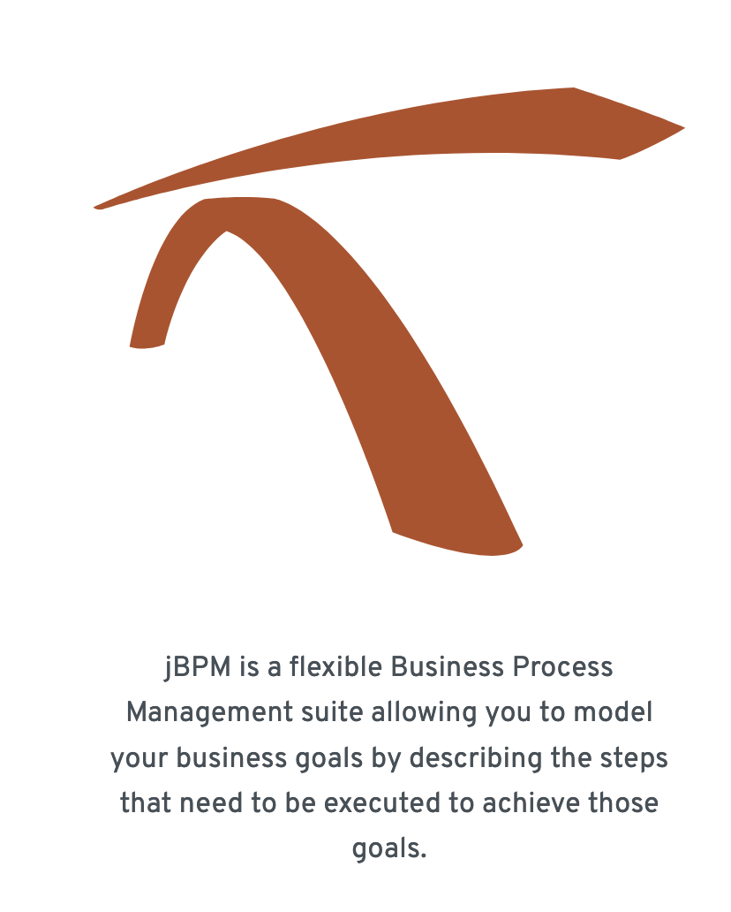
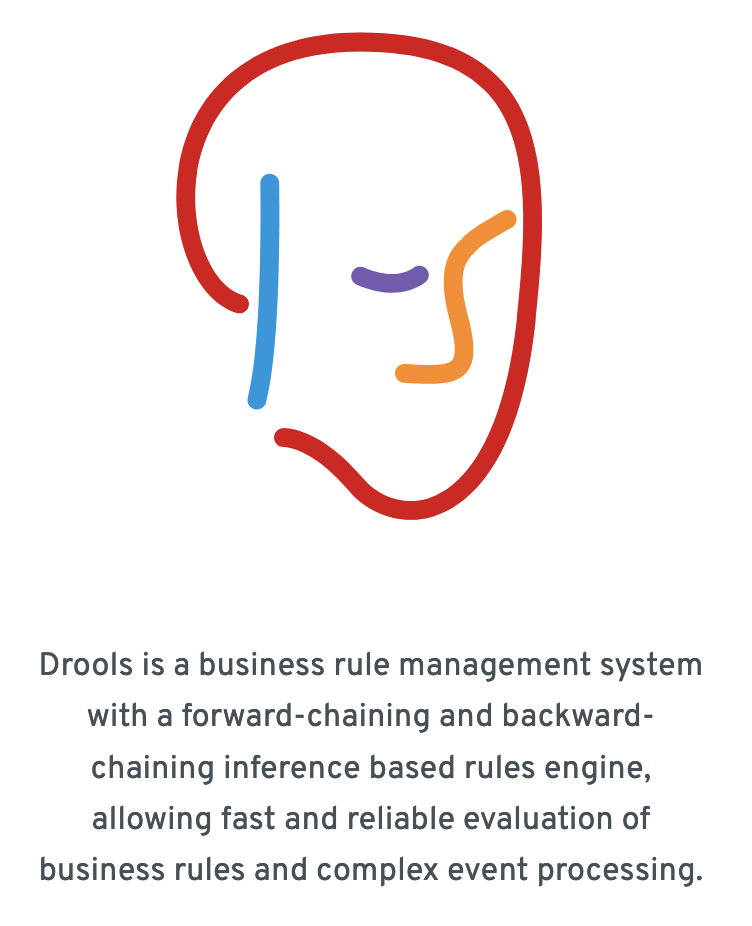
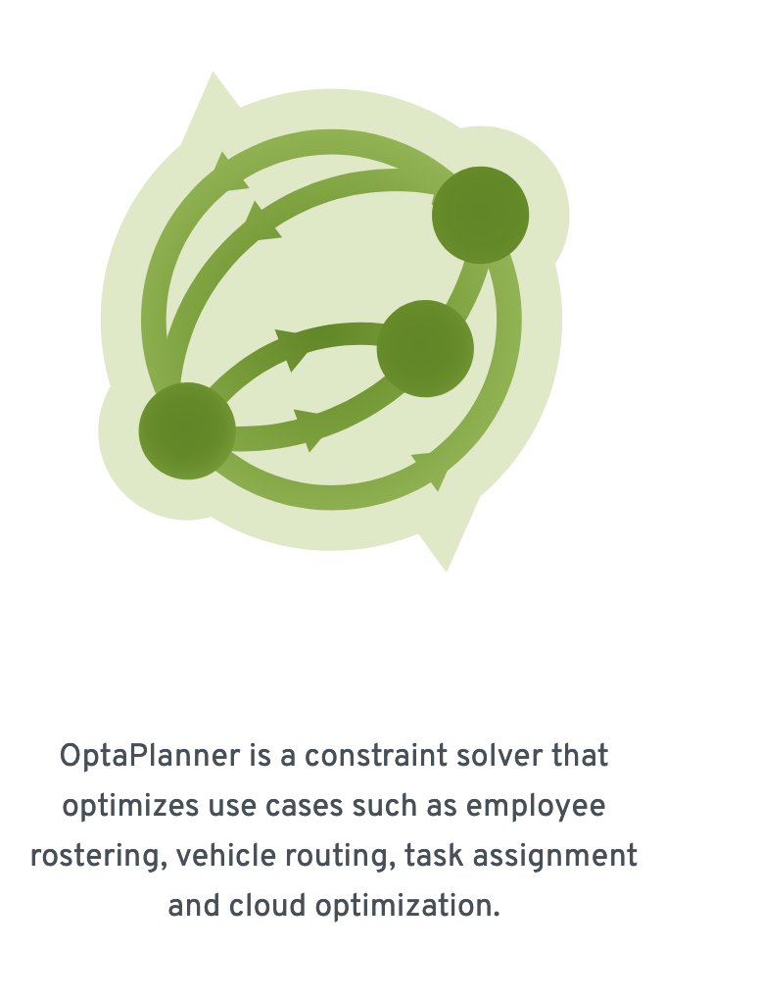
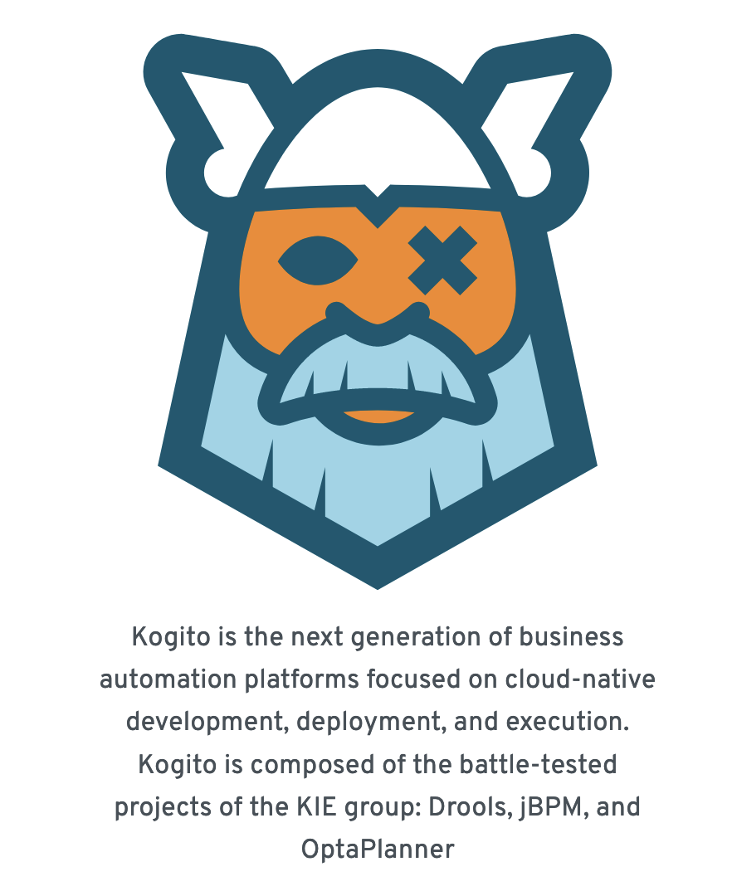
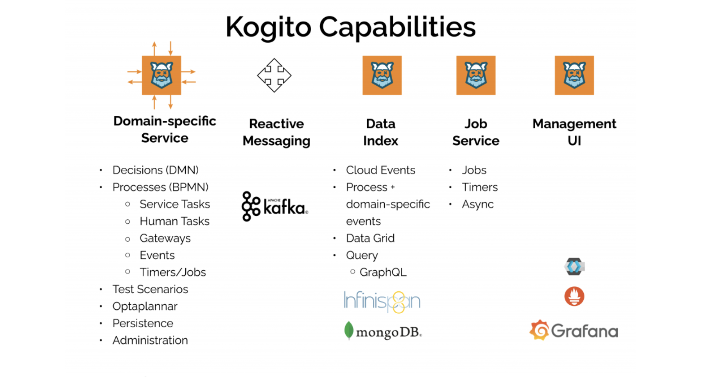

# DBA Serverless and GitOps Samples
## The Kie Open Source Community

The Kie Community is a home for leading Open Source projects that play a role in delivering solutions around Business Automation and Artificial Intelligence in the Cloud. The Kie projects are:

1. jBPM: Business process management
2. Drools: Business rules management
3. OptaPlanner: Solving planning and scheduling constraints
4. Kogito: Cloud-native business automation, serverless workflow

| jBPM                                      | Drools                          |
|-------------------------------------------|---------------------------------|
|                |  |
| OptaPlanner                               | Kogito                          |
|  |  | 

### Difference between the Kogito Community projects and the Red Hat enterprise solutions: [PDF download](https://www.redhat.com/en/resources/whats-the-difference-overview)

**Projects Homes**
- Kie: 
  - https://www.kie.org/
- Drools: 
  - https://www.drools.org/
- jBPM: 
  - https://www.jbpm.org/
- OptaPlanner: 
  - https://www.optaplanner.org/
- Kogito: 
  - https://docs.jboss.org/kogito/release/latest/html_single/

**Other References:**
1. Subscribe, Kie message, bulletin board: https://kie.zulipchat.com
2. Kie group samples: https://github.com/kiegroup/kogito-examples
3. Kie samples: https://github.com/tkobayas/kiegroup-examples